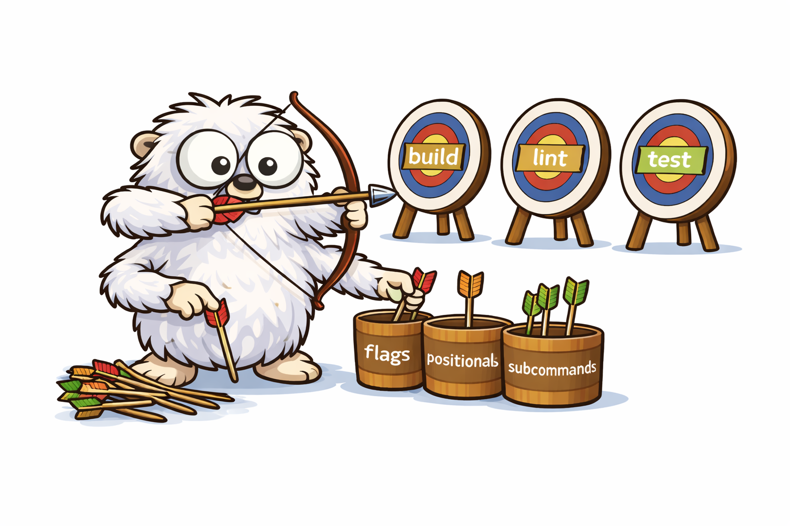

# Targ

<p align="center">
  
</p>

Build CLIs and run build targets with minimal configuration. Inspired by Mage, go-arg, and Cobra.

## Quick Reference

**Key files:** `targ.go` (public API), `sh/` (shell execution), `file/` (file utilities)

| Want to...          | Do this                                               |
| ------------------- | ----------------------------------------------------- |
| Run build targets   | `//go:build targ` files + `targ <command>`            |
| Parse CLI flags     | Struct with `targ:"..."` tags + `targ.Run(&cmd{})`    |
| Run shell commands  | `sh.Run("go", "build")` or `sh.RunContext(ctx, ...)`  |
| Skip unchanged work | `file.Newer(inputs, outputs)` or `file.Checksum(...)` |
| Watch for changes   | `file.Watch(ctx, patterns, opts, callback)`           |
| Run deps once       | `targ.Deps(A, B, C)` or `targ.ParallelDeps(...)`      |
| Scaffold a target   | `targ --alias tidy "go mod tidy"`                     |

## Installation

```bash
# Build tool (run targets)
go install github.com/toejough/targ/cmd/targ@latest

# Library (embed in your binary)
go get github.com/toejough/targ
```

## From Build Targets to Dedicated CLI

Targ makes it easy to start with simple build targets and evolve to a full CLI. The same code works in both modes.

### Stage 1: Simple Functions

Start with plain functions for quick automation. Use `//go:build targ` and don't write a main function:

```go
//go:build targ

package main

import "github.com/toejough/targ/sh"

// Build compiles the project.
func Build() error { return sh.Run("go", "build", "-o", "myapp", "./...") }

// Test runs all tests.
func Test() error { return sh.Run("go", "test", "./...") }
```

```bash
targ build
targ test
```

### Stage 2: Add Flags

Need options? Convert to a struct:

```go
//go:build targ

package main

type Build struct {
    Output  string `targ:"flag,short=o,default=myapp,desc=Output binary name"`
    Verbose bool   `targ:"flag,short=v,desc=Verbose output"`
}

func (b *Build) Run() error {
    args := []string{"build", "-o", b.Output}
    if b.Verbose {
        args = append(args, "-v")
    }
    return sh.Run("go", append(args, "./...")...)
}
```

```bash
targ build --output=myapp --verbose
```

### Stage 3: Dedicated Binary

Ready to ship? Remove the build tag and add main:

```go
package main

import "github.com/toejough/targ"

type Build struct {
    Output  string `targ:"flag,short=o,default=myapp,desc=Output binary name"`
    Verbose bool   `targ:"flag,short=v,desc=Verbose output"`
}

func (b *Build) Run() error { /* same as before */ }

type Test struct {
    Cover bool `targ:"flag,desc=Enable coverage"`
}

func (t *Test) Run() error { /* ... */ }

func main() {
    targ.Run(&Build{}, &Test{})
}
```

```bash
go build -o mytool .
./mytool build --verbose
./mytool test --cover
```

With multiple commands, users select one first. With a single command, flags apply directly:

```go
func main() { targ.Run(&Deploy{}) }  // ./deploy prod --force
```

Niladic functions also work:

```go
func Clean() { fmt.Println("cleaning") }
func main() { targ.Run(Clean) }
```

### Multi-Directory Layout

In build tool mode, discovery is recursive. Commands are namespaced by earliest unique path:

```text
repo/
  tools/
    issues/
      targets.go      # //go:build targ → targ issues <cmd>
    deploy/
      staging.go      # //go:build targ → targ deploy staging <cmd>
      prod.go         # //go:build targ → targ deploy prod <cmd>
```

If only one tagged file exists, commands appear at the root (no namespace prefix).

## Tags

Configure fields with `targ:"..."` struct tags:

| Tag            | Description                                 |
| -------------- | ------------------------------------------- |
| `required`     | Field must be provided                      |
| `positional`   | Map positional args to this field           |
| `flag`         | Explicit flag (default for non-positional)  |
| `name=X`       | Custom flag/positional name                 |
| `short=X`      | Short flag alias (e.g., `short=f` for `-f`) |
| `desc=...`     | Description for help text                   |
| `enum=a\|b\|c` | Allowed values (enables completion)         |
| `default=X`    | Default value                               |
| `env=VAR`      | Default from environment variable           |
| `global`       | Flag available to all subcommands           |
| `subcommand`   | Field is a subcommand                       |
| `subcommand=X` | Subcommand with custom name                 |

Combine with commas: `targ:"positional,required,enum=dev|prod"`

## Subcommands

Define subcommands with struct fields:

```go
type Math struct {
    Add *AddCmd `targ:"subcommand"`
    Mul *MulCmd `targ:"subcommand=multiply"`
}

func (m *Math) Run() {
    fmt.Println("Usage: math <add|multiply>")
}

type AddCmd struct {
    A, B int `targ:"positional"`
}

func (a *AddCmd) Run() {
    fmt.Printf("%d\n", a.A+a.B)
}
```

```bash
./math add 2 3      # 5
./math multiply 2 3 # 6
```

## Command Signatures

`Run` methods and function commands support these signatures:

- `func()`
- `func() error`
- `func(context.Context)`
- `func(context.Context) error`

## Command Descriptions

Document commands with comments (parsed from source):

```go
// Deploy pushes code to the specified environment.
// Requires valid AWS credentials.
func (d *Deploy) Run() error { ... }
```

Or implement `Description()` for dynamic descriptions:

```go
func (d *Deploy) Description() string {
    return "Deploy to " + d.defaultEnv()
}
```

## Command Names

Names are derived from struct/function names, converted to kebab-case:

| Definition               | Command     |
| ------------------------ | ----------- |
| `type BuildAll struct{}` | `build-all` |
| `func RunTests()`        | `run-tests` |

Override with `Name()`:

```go
func (c *MyCmd) Name() string { return "custom-name" }
```

## Dependencies

Run dependencies exactly once per invocation. By default, Deps **fails fast** - stops on first error:

```go
func Build() error {
    return targ.Deps(Generate, Compile)  // stops if Generate fails
}

func Test() error {
    return targ.Deps(Build)  // Build only runs once even if called multiple times
}
```

```bash
targ test lint  # runs Generate, Compile, Build, Test, then Lint - each only once
```

Options can be mixed with targets:

```go
// Parallel execution (fail-fast, cancels siblings on error)
func CI() error {
    return targ.Deps(Test, Lint, targ.Parallel())
}

// Run all even if some fail
func CheckAll() error {
    return targ.Deps(Lint, Test, Vet, targ.Parallel(), targ.ContinueOnError())
}

// Pass context for cancellation
func Watch(ctx context.Context) error {
    return file.Watch(ctx, []string{"**/*.go"}, file.WatchOptions{}, func(_ file.ChangeSet) error {
        targ.ResetDeps()
        return targ.Deps(Tidy, Lint, Test, targ.WithContext(ctx))
    })
}
```

| Option | Effect |
|--------|--------|
| `targ.Parallel()` | Run concurrently instead of sequentially |
| `targ.ContinueOnError()` | Run all targets, return first error |
| `targ.WithContext(ctx)` | Pass context to targets (for cancellation) |

## Shell Helpers

Use `targ/sh` for command execution:

```go
import "github.com/toejough/targ/sh"

err := sh.Run("go", "build", "./...")           // inherit stdout/stderr
err := sh.RunV("go", "test", "./...")           // print command first
out, err := sh.Output("go", "env", "GOMOD")     // capture output
```

For cancellable commands (e.g., in watch mode), use context variants. When cancelled, the entire process tree is killed:

```go
err := sh.RunContext(ctx, "go", "test", "./...")
err := sh.RunContextV(ctx, "golangci-lint", "run")
out, err := sh.OutputContext(ctx, "go", "list", "./...")
```

## File Checks

Skip work when files haven't changed:

```go
import "github.com/toejough/targ/file"

needs, err := file.Newer([]string{"**/*.go"}, []string{"bin/app"})
if !needs {
    return nil  // outputs are up to date
}
```

Content-based checking (when modtimes aren't reliable):

```go
changed, err := file.Checksum([]string{"**/*.go"}, ".cache/build.sum")
if !changed {
    return nil
}
```

## Watch Mode

React to file changes:

```go
func Watch(ctx context.Context) error {
    return file.Watch(ctx, []string{"**/*.go"}, file.WatchOptions{}, func(_ file.ChangeSet) error {
        targ.ResetDeps()  // clear dep cache so targets run again
        return sh.RunContext(ctx, "go", "test", "./...")
    })
}
```

For interruptible watch (cancel running command when new changes arrive):

```go
func Watch(ctx context.Context) error {
    var cancel context.CancelFunc
    return file.Watch(ctx, []string{"**/*.go"}, file.WatchOptions{}, func(_ file.ChangeSet) error {
        if cancel != nil {
            cancel()  // stop previous run
        }
        var runCtx context.Context
        runCtx, cancel = context.WithCancel(ctx)
        targ.ResetDeps()
        return sh.RunContext(runCtx, "go", "test", "./...")
    })
}
```

## Shell Completion

```bash
source <(your-binary --completion bash)   # Bash
source <(your-binary --completion zsh)    # Zsh
your-binary --completion fish | source    # Fish
```

Supports commands, subcommands, flags, and enum values.

## Example Help Output

```
$ ./deploy --help
Deploy pushes code to the specified environment.

Usage: deploy <env> [flags]

Arguments:
  env    Environment to deploy to (required, one of: dev, staging, prod)

Flags:
  -f, --force    Skip confirmation
  -h, --help     Show this help
```

## Dynamic Tag Options

Override tag options at runtime:

```go
type Deploy struct {
    Env string `targ:"positional,enum=dev|prod"`
}

func (d *Deploy) TagOptions(field string, opts targ.TagOptions) (targ.TagOptions, error) {
    if field == "Env" {
        opts.Enum = strings.Join(loadEnvsFromConfig(), "|")
    }
    return opts, nil
}
```

Useful for loading enum values from config, conditional required fields, or environment-specific defaults.

## Patterns

### Conditional Build

```go
func Build() error {
    needs, _ := file.Newer([]string{"**/*.go"}, []string{"bin/app"})
    if !needs {
        fmt.Println("up to date")
        return nil
    }
    return sh.Run("go", "build", "-o", "bin/app", "./...")
}
```

### CI Pipeline

```go
func CI() error {
    if err := targ.Deps(Generate); err != nil {
        return err
    }
    if err := targ.ParallelDeps(Build, Lint); err != nil {
        return err
    }
    return targ.Deps(Test)
}
```

### Testing Commands

```go
func TestDeploy(t *testing.T) {
    result, err := targ.Execute([]string{"app", "deploy", "prod", "--force"}, &Deploy{})
    if err != nil {
        t.Fatal(err)
    }
    if !strings.Contains(result.Output, "Deploying to prod") {
        t.Errorf("unexpected output: %s", result.Output)
    }
}
```

### Variadic Positional Args

```go
type Cat struct {
    Files []string `targ:"positional,required"`
}

func (c *Cat) Run() error {
    for _, f := range c.Files {
        // process each file
    }
    return nil
}
```

```bash
./cat file1.txt file2.txt file3.txt
```

### Ordered Repeated Flags

When flag order matters (e.g., include/exclude filters), use `[]targ.Interleaved[T]`:

```go
type Filter struct {
    Include []targ.Interleaved[string] `targ:"flag,short=i"`
    Exclude []targ.Interleaved[string] `targ:"flag,short=e"`
}

func (f *Filter) Run() error {
    type rule struct {
        include bool
        pattern string
        pos     int
    }
    var rules []rule
    for _, inc := range f.Include {
        rules = append(rules, rule{true, inc.Value, inc.Position})
    }
    for _, exc := range f.Exclude {
        rules = append(rules, rule{false, exc.Value, exc.Position})
    }
    sort.Slice(rules, func(i, j int) bool {
        return rules[i].pos < rules[j].pos
    })
    // rules now in original command-line order
    return nil
}
```

```bash
./filter -i "*.go" -e "vendor/*" -i "*.md"
# Processes in order: include *.go, exclude vendor/*, include *.md
```

## When to Use Targ

| Need                                | Tool         |
| ----------------------------------- | ------------ |
| Build targets + CLI parsing         | **Targ**     |
| Simple build targets only           | Targ or Mage |
| Simple struct-to-flags mapping      | go-arg       |
| Complex CLI with plugins/middleware | Cobra        |

**Targ's sweet spot**: Build automation that can evolve into a full CLI, or CLI parsing with minimal boilerplate.

## Build Tool Flags

| Flag                        | Description                                  |
| --------------------------- | -------------------------------------------- |
| `--no-cache`                | Force rebuild of the build tool binary       |
| `--keep`                    | Keep generated bootstrap file for inspection |
| `--init [FILE]`             | Create a starter targets file (default: targs.go) |
| `--alias NAME "CMD" [FILE]` | Add a shell command target (auto-creates file)    |
| `--completion [bash\|zsh\|fish]` | Print shell completion script           |

### Quick Target Scaffolding

Use `--alias` to add targets - it auto-creates `targs.go` if no target files exist:

```bash
targ --alias tidy "go mod tidy"      # creates targs.go, adds Tidy
targ --alias lint "golangci-lint run" # appends to targs.go
```

If multiple target files exist, specify which one:

```bash
targ --alias test "go test ./..." build.go
```

Kebab-case names are converted to PascalCase (`run-tests` → `RunTests`).

## Cache Management

Targ caches compiled binaries in `~/.cache/targ/`. The cache is invalidated when source files or `go.mod`/`go.sum` change.

```bash
targ --no-cache <command>   # force rebuild
rm -rf ~/.cache/targ/       # clear all cached binaries
```
